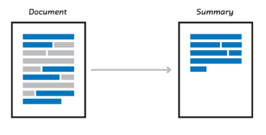

# Text-Summarization

**There are two main types of how to summarize text in NLP -**

**1.Extraction-based summarization**

These methods rely on extracting several parts, such as phrases and sentences, from a piece of text and stack them together to create a summary. Therefore, identifying the right sentences for summarization is of utmost importance in an extractive method.

**2.Abstractive-based summarization**

These methods use advanced NLP and Deep learning techniques to generate an entirely new summary. Some parts of this summary may not even appear in the original text. 
The abstractive text summarization algorithms create new phrases and sentences that relay the most useful information from the original text — just like humans do.
Therefore, abstraction performs better than extraction. However, the text summarization algorithms required to do abstraction are more difficult to develop; that’s why the use of extraction is still popular.

