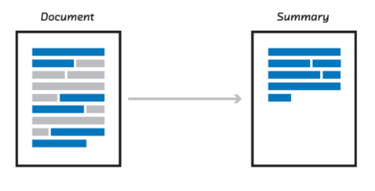
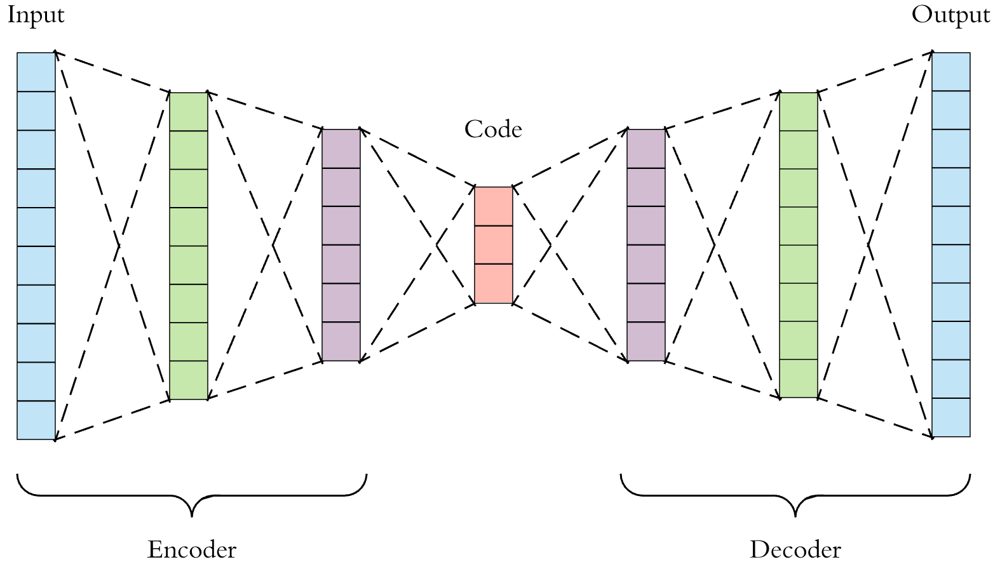
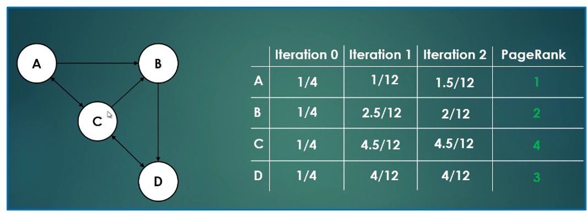
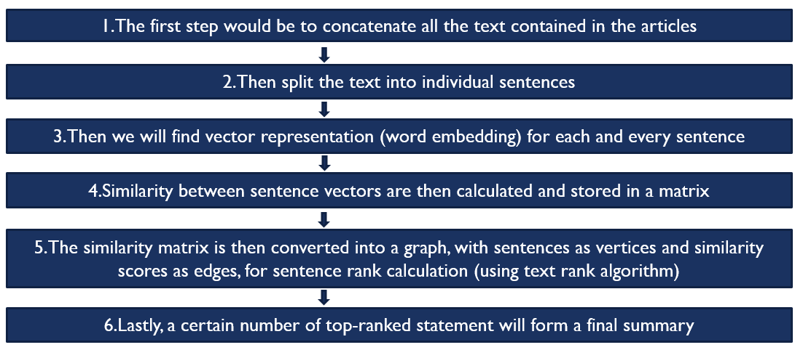
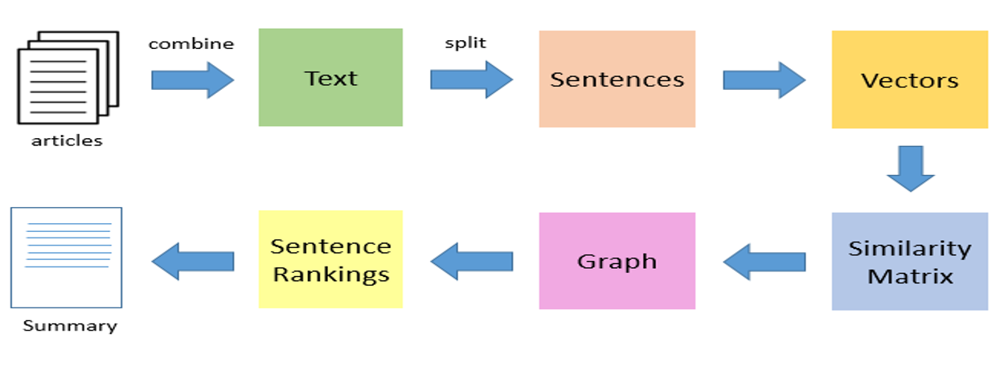
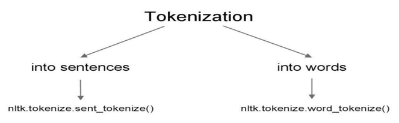

# Text-Summarization

Text summarization refers to the technique of shortening long pieces of text. The intention is to create a coherent and fluent summary having only the main points outlined in the document.Applying text summarization reduces reading time, accelerates the process of researching for information, and increases the amount of information that can fit in an area.

There are many reasons and uses for a summary of a larger document -
* Headlines (from around the world)
* Outlines (notes for the student)
* Minutes (of a meeting) , and many more.

**There are two main types of how to summarize text in NLP -**

**1.Extraction-based summarization**

These methods rely on extracting several parts, such as phrases and sentences, from a piece of text and stack them together to create a summary. Therefore, identifying the right sentences for summarization is of utmost importance in an extractive method.

**2.Abstractive-based summarization**

These methods use advanced NLP and Deep learning techniques to generate an entirely new summary. Some parts of this summary may not even appear in the original text. 
The abstractive text summarization algorithms create new phrases and sentences that relay the most useful information from the original text — just like humans do.
Therefore, abstraction performs better than extraction. However, the text summarization algorithms required to do abstraction are more difficult to develop; that’s why the use of extraction is still popular.

# Extraction-based Method

For this method first need to have better knowledge of **PageRank Algorithm** a method for rating the importance of web pages objectively and mechanically using the link structure of the web or, In short PageRank is a “vote”, by all the other pages on the Web, about how important a page is. This is how it works -

**Steps used in Algorithm**

**Flowchart**

**Step-1**

To combine all the text it can done simply using **Pandas** library.

**Step-2**

To split the text into sentence will do this using NLP library called **NLTK** using Tokenization concept.
**Tokenization** is the process of breaking a stream of text up into words, symbols, or other meaningful elements called tokens.
Tokenization is generally done in two ways **Sentence** and **Word tokenization**.
We will be using **Sentence tokenization**.

